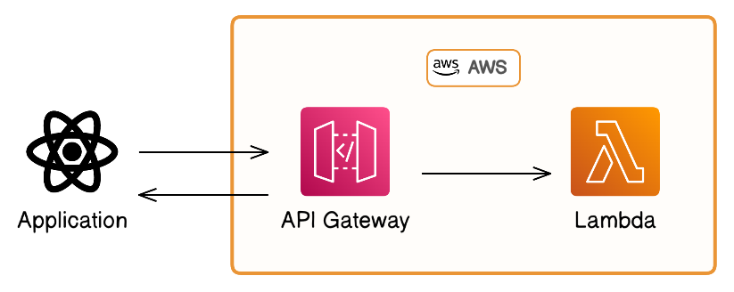
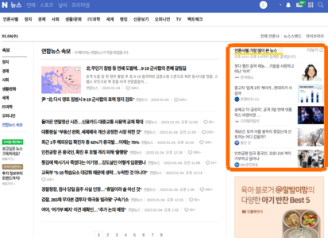
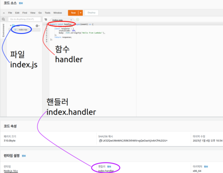

import Callout from 'nextra-theme-docs/callout'

# AWS Lambda에 crawlee 올리기

## 개요

저는 아침마다 뉴스를 확인하곤 합니다.  
그래서 주요 뉴스를 크롤링 해서 토이 프로젝트에 띄워주면 편하겠다는 생각이 들었습니다.

그런데 이 크롤러 때문에 24시간 서버를 켜두기는 조금 부담스러웠고  
필요할 때 event를 통해 작동하는 AWS Lambda에 올려보기로 했습니다.

## Ⅰ. 뉴스 크롤러 작성
먼저 크롤링 하고자 하는 뉴스는 `네이버 뉴스`입니다.

  
우측에 '가장 많이 본 뉴스'의 제목과 url 정보를 크롤링 하고자 했습니다.

크롤러는 **[`Crawlee`](www.google.com)라는 오픈소스 패키지**를 활용 했습니다.  
다양한 크롤러 클래스를 제공하고 document가 잘 작성돼 있었던게 장점 이었습니다.

제공되는 것 중에 가장 가벼운 **Cheerio**를 선택 했는데요.  
제가 크롤링 하고자 하는 대상이 복잡하지 않았기 때문도 있지만,  
후에 AWS Lambda에 올릴 것을 염두했기 때문입니다.

```js
// Cheerio 크롤러 일부분
const headlines = [];
$('#_rankingList0 > li').each((index, element) => {
    const headlineTitle = $(element).find('div > div> div > a').text();
    const headlineUrl = $(element).find('div > div> div > a').attr('href');
    headlines.push({ title: headlineTitle, url: headlineUrl});
    log.info(`${index} : ${headlineTitle}, ${headlineUrl}\n`);
  });
```
Cheerio는 다른 browser 베이스 크롤러와는 달리 간단히 HTML 파싱하여 원하는 정보를 찾습니다.  
여기서 jQuery 문법이 쓰이기에 jQuery-like 라이브러리라고 불리기도 합니다.

## Ⅱ. AWS Lambda
### ⅰ. 핸들러 함수 작성
작성한 크롤러를 AWS Lambda에 올리려면 핸들러 함수를 작성 해야 합니다.  
이는 Lambda 함수가 트리거 됐을 시 실행되는 함수인데요.

AWS Console에서 Node.js 런타임으로 Lambda 함수를 생성하면   
  
인라인 코드 편집창에 핸들러 함수가 기본적으로 작성되어 있습니다.

살펴보면 `index.mjs` 파일이 있고 내용으로 `handle` 함수가 있습니다.  
이 `handle` 함수는 리턴으로 상태 코드 200과 함께 Hello from Lambda! 라는 string을 응답합니다.

이게 핸들러 함수 원형이며 이 안에 제가 작성한 크롤러를 넣고 적절히 수정하여 핸들러 함수를 작성했습니다.  
(크롤러 코드가 길어 [GitHub 코드 링크](www.google.com)를 남겨 놓겠습니다.)

하지만 이렇게만 마무리하면 크롤러 모듈인 `crawlee`를 import할 때 문제가 생깁니다.  
왜냐하면 Lambda는 해당 모듈이 없기에 로컬에서 zip 파일 또는 S3로 올려주어야 합니다.

전체적인 순서는 이렇습니다.
1. 작성된 크롤러를 핸들러에 통합
2. `npm install packageForFunc`로 필요한 모듈 설치
3. `unzip -r ../myFunc.zip ./*`하여 zip 파일로 압축
4. aws-cli 또는 AWS Console로 zip 파일 업로드

이렇게 AWS Lambda에서 원하는 모듈을 쓸 수 있습니다.

(만약 업로드 할 zip 파일의 용량이 50mb가 넘는다면 S3을 이용하여 올릴 수 있습니다.  
아니면 docker image를 ECR에 올려서 이를 활용하는 방법도 있습니다.)

### ⅱ. API Gateway 연결
이제 Lambda 함수를 외부에서 호출할 수 있게 하는 과정입니다.  
이를 위해 API Gateway를 트리거로 달아야 합니다.

새로운 API 추가 단계에서는 API 타입과 보안을 선택하게 됩니다.  
동시에 보안에 대해서도 Open을 고르거나 또는 인증을 요구하여 접근을 제한할 수 있습니다.

저는 API Gateway를 각각 타입별로 생성을 해보았는데요.
- **HTTP API 타입 / 보안: Open**  
테스트용으로 보안 없이 추가한 API Gateway입니다.  
(https://6enmgybdod.execute-api.ap-northeast-2.amazonaws.com/default/naver-headline-crawler)  
위와 같은 API endpoint를 확인 할 수 있었습니다.

- **REST API 타입 / 보안: API key**  
토이 프로젝트에 올릴 용도로 API key 인증을 요구하는 API Gateway입니다.  
Key 없이는 접근이 제한 되는데요 아래와 같은 curl 명령어로 통과 여부를 확인할 수 있습니다.  
`$ curl -X GET -H "x-api-key: 키값" -H "Content-Type: application/json" -d '{"key":"val"}' https://t3eb5ja42j.execute-api.ap-northeast-2.amazonaws.com/default/naver-headline-crawler`

## 결과물
[이미지 오브 헤드라인스] GIF

사실 AWS Lambda를 다뤄보면서 여러 시행착오를 겪었습니다.  
그래도 직접 User를 생성하고 IAM로 권한 부여 등을 해보면서 조금씩 익숙해 질 수 있었고  
처음으로 AWS를 다뤄봤다는게 굉장히 뿌듯했습니다.

이상으로 AWS Labmda에 작성한 크롤러를 올려본 과정을 마치겠습니다.
- - -
References)  
[1] Cyril Gorrieri, "[Web crawler with Crawlee and AWS Lambda](https://cyril-gorrieri.medium.com/web-crawler-with-crawlee-and-aws-lambda-223582bdca3e)" [medium, 2022 Nov.] | Accessed: 2023-01-03  
[2] John Allen, "[How to load npm module in aws lambda](https://stackoverflow.com/questions/34437900/how-to-load-npm-modules-in-aws-lambda)" [StackOverflow, 2019 Jul.] | Accessed: 2023-01-03  
[3] keithrozario, "[What is the Handler?](https://aws-lambda-for-python-developers.readthedocs.io/en/latest/02_event_and_context/)" [AWS Lambda for Python Developers, 2020 May.] | Accessed: 2023-01-04  