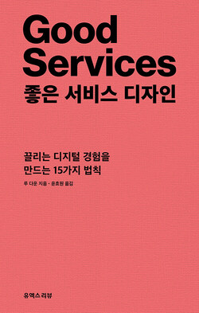

import Callout from 'nextra-theme-docs/callout'

# 좋은 서비스 디자인

<Callout emoji="👤">
  루 다운(Lou Downe) / 2021년
</Callout>

## 좋은 서비스란?
이 책은 좋은 서비스를 위해 15개의 법칙을 소개하는데요.  
가장 먼저 서비스가 가진 의미를 정의합니다.  
- 좋은 서비스란  
`누군가 필요한걸 알맞게 제공하거나 돕는 것.`

정의를 이해 하고 나서는 찾기 쉬움, 목적을 분명히와 같은  
좋은 서비스를 만들기 위한 법칙들이 1번 부터 15번 까지 나열됩니다.  

얼핏보면 당연한 것들이라 '이런걸 놓칠 수 있나?' 싶었습니다.  
그러나 실제 실패한 사례를 살펴보면 정부와 기업을 막론하고  
해당 법칙을 신경쓰지 못하면 곧바로 서비스의 실패로 이어진다는 아주 중요한 교훈을 줍니다.

특히 서비스의 목적과 기대치를 명확히 해야 한다고 합니다.
- **서비스의 목적이란**
  - 서비스가 *어떤 역할*을 하는지?
  - *어떤 방식*으로 서비스 하는지?
  - *누구를 위한* 서비스인지?

에 대한 것 이구요.

- **서비스의 기대치란**  
  - 기대치는 3가지로 나뉘는데 보편적, 추정적, 예외적 기대치입니다.  

이러한 기대치들이 잘 충족되고 있는지, 아니라면 이를 잘 설명하는 것이 중요하다고 합니다.

많은 인상 깊은 내용들이 있었지만 그 중 **기생 서비스**에 대한 것도 있었습니다.  
예를 들어 세금 신고서 제출과 같은 복잡한 일을 대신하는 서비스가 기생 서비스입니다.  
(이때 스스로하면 무료여야 합니다!)

저자는 이런 기생 서비스를 제공하는 것이 악순환을 낳는다라고 했는데요.  
이 말에 어느정도 동의는 합니다만.. 작년에 핫했던 삼쩜삼 처럼  
'실질적으로 사용자의 시간을 아껴준 서비스가 그렇게 나쁜 것인가?'  
라는 의문이 들기도 했습니다.  

전에는 서비스는 그저 만들어 제공하는 것으로만 생각했었습니다.  
하지만 이 책을 읽고 서비스를 디자인한다는 관념을 얻었을 뿐만 아니라,  
**`서비스 단계의 수 = 사용자 결정의 수`**  
와 처럼 마치 공식과 같이 실질적으로 적용할 수 있는 내용이 있어 좋은 책입니다.

## 인상 깊은 문장들
- p.73 : 보편적 기대치를 충족하고, 추정적 기대치를 최소화하며, 예외적 기대치를 주시하며 시대의 흐름에 따라 변하는 보편적 기대치를 대비한다.
- p.83 : 사용자의 목표를 이루는 시작점부터 끝점까지 전체를 디자인한다.
- p.113 : 조직이 분리되고 고립된 개발자로 이뤄진다면, 결국은 분리되고 고립된 서비스가 나올 것이다.
- p.116 : 조직은 단순히 서비스를 구축하는 기계가 아니다. 서비스 고장 시 수리하고, 아무도 찾지 않는 오래된 서비스가 되었다면 이를 새롭게 디자인 하는게 조직이다.
- p.122 : 무엇이 되었든 우리는 가능한 효율적으로 결과를 얻기 원한다.
- p.134 : 하나의 팀으로 일할 때는 가장 약한 고리가 서비스를 실패로 이끈다.
- p.140 : 조사에 따르면 고객이 일등석을 통과해 이코노미석으로 갈 경우 폭력이 발생할 확률이 30%나 증가한다.  
  (예외를 두지 않았을 때 발생하는 흥미로운 결과ㅋㅋㅋ)
- p.167 : 포용은 서비스의 개선 사항이 아닌 필수 사항이다.
- p.189 : 달성하고자 하는 것이 무엇인지 명심한다.
- p.216 : 서비스를 차별화 하는 요소는 실패 여부가 아니라 실패했을 때 대처하는 방식에 달려있다.
