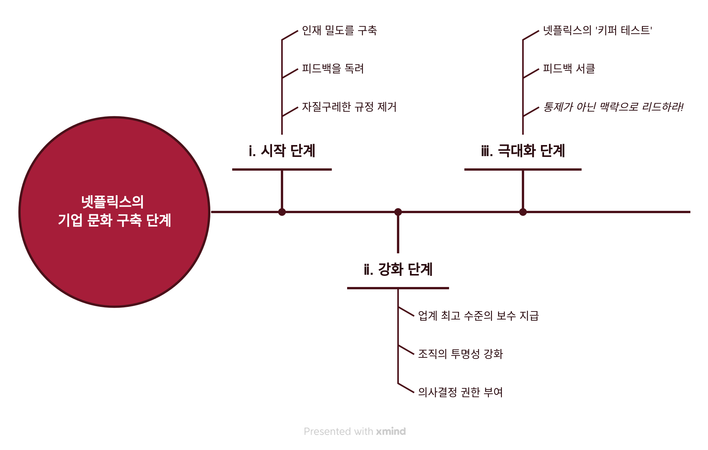
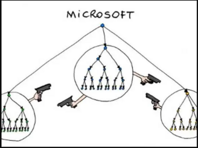

import Callout from 'nextra-theme-docs/callout'

# 규칙 없음


<Callout emoji="👤">
  리드 헤이스팅스(Reed Hastings), 에린 마이어(Erin Meyer) / 2020년
</Callout>

## 도표


넷플릭스는 1998년 DVD를 우편 배달하는 사업으로 시작했는데요.  
훗날 전 세계 190개국에 스트리밍 서비스 할 정도로 성장한 넷플릭스만의 기업 문화를 소개합니다.  

어떻게 이런 문화를 구축하게 됐는지 3단계로 나누어 설명해주는 책입니다.  

## Ⅰ. 시작 단계
시작 단계에서는 어떤 시행착오를 거치며 넷플릭스 문화의 토대를 마련했는지를 설명합니다.
### ⅰ. 인재 밀도
CEO인 리드 헤이스팅스는 우연한 계기로 기업 문화에서 중요한 요소를 찾게 됩니다.

2001년 닷컴 버블이 꺼지고 정리 해고해야만 하는 상황에 맞닥뜨렸었습니다.  
특별히 성과가 떨어지는 직원이 없었기에 주로 불평이 많거나 판단력이 부족한 직원들을 추려 내보냈습니다.

무려 전 직원의 30%에 달하는 수를 해고하고 나니 남은 직원들의 사기가 걱정됐습니다. 회사가 직원을 함부로 대한다는 인상을 줄 수 있기 때문이죠.  
하지만 놀랍게도 회사가 오히려 잘 나가고 분위기마저 좋아지는 상황을 보면서 CEO는 **인재 밀도**의 중요성을 깨닫게 됩니다.

이를 뒷받침 하는 재밌는 실험을 하나 소개해 주는데요.  
실험자들에게 조별 과제를 내주고 1등 하면 10만원을 준다고 약속합니다.  
그러고는 몰래 실험자 사이에 배우를 심어둡니다. 이때 배우들은 이러한 역할을 수행합니다.
- 게으름뱅이 특 : 눈치를 주든 말든 핸드폰만 계속 함
- 삐딱이 특 : 기분 나쁘게 시비를 매우 잘 검
- 비관주의자 특 : 기르던 고양이가 막 죽은 표정으로 포기하자고 함

반복적인 실험으로 통계를 내보니 배우가 섞여들어 간 팀은 성과가 30~40% 떨어졌다고 합니다.  
그뿐만 아니라 배우가 연기한 특성이 전염되는 모습도 관찰되었다고 하는데요.  
이처럼 미꾸라지 한 마리가 조직 전반에 미치는 영향이 얼마나 큰지 알 수 있던 실험입니다.

이 인재 밀도 구축이라는 항목이 중요한 이유가 또 있는데요.  
믿을 수 있고 비범한 동료로만 팀이 구성된다는 점이 선결되지 않는다면요 이후 단계들은 무용지물이 되기 때문에 중요하다고 할 수 있습니다. 

### ⅱ. 피드백
길에서 차량의 속도를 실시간으로 알려주는 표시기를 본 적 있으신가요?  
일반적인 표지판을 놓았을 때 보다 더 효과적으로 규정 속도를 지키게끔 만들었다는 결과가 있습니다.
  
이처럼 조직에서도 피드백을 활용하면 성과가 개선되고 직원들의 성장 속도는 빨라진다고 합니다.  
상사, 부하 할 것 없이 자유롭고 솔직하게 피드백함으로써 더 발전할 수 있습니다.

저는 미국 같은 경우에 부하가 상사에게 직언하는게 우리나라 보다는 쉽지 않을까? 생각 했었는데요.  
근데 보통 미국 직장 또한 마찬가지로 이게 어려운 일이라고 합니다.  

그래서 넷플릭스는 직원을 고용한 이유가 직원의 의견을 듣기 위한 것임을 강조합니다.  
더 나아가 원활한 피드백 시스템을 만들기 위해 **4A 피드백 지침**을 만들어 정착 시킵니다.
- 피드백을 줄 때
  - 도움을 주겠다는 생각으로 하라 (Aim to support)
  - 실직적인 조치를 함께 포함하라 (Actionable)
- 피드백을 받을 때
  - 고마움을 표해라 (Appreciate)
  - 받아들이거나 거부하는 것은 자유다 (Accept or discard)

하지만 꼭 기억할 점이 있습니다.  
솔직한 피드백을 준답시고 타인을 무시하는 재수없는 짓을 하면 안됩니다!!

### ⅲ. 자질구레한 규정
리드 헤이스팅스는 넷플릭스 창업 전 '퓨어 소프트웨어' 라는 기업을 운영한 적이 있습니다.  
여느 기업과 다를 바 없이 기업의 몸집이 커지며 규정이 생길 수 밖에 없었던 상황을 설명하는데요.

예를 들면,  
a) 사무실에 개를 데려와 난장판이 됨 → 강아지 금지 규정 설립  
b) 출장가서 숙박비 70만원 긁어버리기 → 출장비 제한 규정 설립

이러한 규정이 늘어나는 과정 속에 눈에 띄는 단점이 발생합니다.  
직원들 **창의력이 현저하게 떨어지고** 또 **외부변화에 유연성이 떨어집니다**.

그래서 넷플릭스는 실험도 해보고 시행착오를 거쳐서 근무 시간 및 휴가 규정을 철폐하기로 합니다.  
(물론 단점만 보고 규정을 철폐한 것은 아닙니다. CEO 마인드 자체가 근무 시간 보다 성과를 우선시하기 때문에 그런 것도 있습니다.)  

CEO가 규정을 없애면서도 2가지 걱정이 있었습니다.
1. 모두가 휴가를 안써서 좀비가 되어버리는 걱정
2. 모두가 휴가를 써서 사무실이 마비되는 걱정

1번은 다른 회사에서 휴가 규정을 없애봤더니 그나마도 보장되어 있던 휴가를 눈치를 보며 아예 안쓰게 되었다는 사례를 듣고나서 생긴 걱정 이었습니다.  
아무튼 1번을 해결하는 방법으로 리더가 솔선수범으로 휴가를 쓰면 된다고합니다.

2번은 실제로 마감이 코 앞인데 팀 절반이 휴가를 낸 일이 있었어서 CEO 입장에서 굉장히 두려웠다고 고백합니다.  
그러나 리드 헤이스팅스는 규정을 되살리지 않고 문제를 해결했는데요. 바로 팀 내부에서 의논하여 어떻게 휴가를 쓰면 피해가 없을지 맥락을 설명하고 휴가를 쓰게 했다고합니다.

근데 또 이렇게 되면 휴가를 쓰지 않을게 걱정이 되었는지 분기 별로 세심히 관찰한다고 해요.ㅋㅋㅋ

규정을 없앤다는게 얼핏보면 간단한 문제인듯 싶지만 생각보다 그렇게 단순하지는 않은 것 같습니다.  
그래도 이를 통해 인재 확보가 수월해지고, 직원 만족도가 상승한다고 합니다.  
그러면서 자연스럽게 넷플릭스의 문화를 관통하는 한마디인 **자유와 책임**이 생기게 됩니다.

이러한 문화 속에서 회사 일을 하면서 발생하는 비용 처리와 관련해서도 규정을 모두 철폐하며   
딱 한가지 말만 남겨 놓습니다.  
"***넷플릭스에 가장 이득이 되게 행동하라.***"  
이 대원칙 아래에서 직원들은 자유롭게 행동하지만 이를 악용했을 경우 그 책임을 물게끔 합니다.

이것이 바로 넷플릭스 규칙 없음의 핵심입니다!

## Ⅱ. 강화 단계
강화 단계는 결국 1단계에서 마련한 토대를 어떻게하면 더 발전 시킬까가 골자입니다.  

### ⅰ. 업계 최고 수준의 보수
리드 헤이스팅스는 더 밀도 있는 인재의 중요성을 이야기하며 한 프로그래머 연구를 이야기합니다.  
록스타 원칙 연구라고도 불리는 이 실험을 각각의 프로그래머가 작업을 할 때 얼마나 역량의 편차를 갖고 있는지를 확인하는 실험이었습니다.

예측하기로는 그래도 제일 잘하는 사람이 3배 정도 잘하지 않겠나 했지만 실제 결과는 놀라웠습니다.  
무려 20배 정도 차이가 났었는데. 이 결과는 직원 1명이 20명 보다 나을 수 있다는 걸 시사합니다.

넷플릭스는 이러한 내용을 바탕으로 먼저 지원자가 대체 불가능한 실력자임을 확인합니다.  
그러고나서 실력자임이 밝혀진다면 그가 직전에 얼마를 받았건 **업계 최고 수준의 연봉**을 제공하는 전략을 세웁니다.

이 뿐만 아니라 사내 재직자가 다른 회사에서 이직 제안이 온다면 그것을 숨기지 말아달라고 합니다.  
심지어는 제안 금액까지 넷플릭스에 이야기 해주면 연봉을 올려주어 인재를 유출을 막습니다.

### ⅱ. 조직의 투명성
그 다음은 솔직함을 넘어 투명성을 위해 노력을 기울이라고 합니다.

넷플릭스 사무실에는 대표실도 없고 심지어 칸막이도 없다고 합니다.  
폐쇄된 공간은 그곳이 은밀한 곳이라는 인상을 주며 서로를 믿을 수 없게 만들기 때문이라네요.

그리고 직원들에게 재무, 구조조정, 해고 사유(프라이버시가 아니면) 등을 모조리 공개합니다.  

이렇게 회사 기밀을 공개하는 것은 직원들의 주인의식과 충섬심을 갖게 하는데 도움을 준다고 합니다.

### ⅲ. 의사결정 권한
넷플릭스는 회사 직원이 각자가 의사 결정할 때 빠르고 혁신적인 아이디어가 나올 수 있다고 합니다.  
이를 '분산된 의사결정 모델'이라고 하고 넷플릭스 문화의 초석이자 혁신의 원동력이라고 합니다.

물론 인재 밀도가 높고, 투명하지 않은 조직에서는 오히려 역효과만 나는 방법이긴 합니다.

그러면서 또 **혁신 사이클 4단계**를 설명합니다.  
요약하면 '상사의 비위를 맞추지 말고', '아이디어를 서로 공유하고', '그 내용을 테스트하라.'  
이 과정을 모두 거치고 나면 당사자가 직접 베팅하여 사업을 추진하게 됩니다.  
말이 좀 어렵긴 한데... 한마디로 자유와 책임 속에서 과감히 일하라는 뜻인 것 같습니다.  

저는 개인적으로 그 이후 단계가 마음에 들었는데요. 바로 성공과 실패의 단계입니다.  
일이 성공하면 진심으로 축하 해주면 되는거고, 실패하면 **선샤이닝** 하라고 이야기합니다.  
그러니까 실패해도 숨기지 말라는 뜻인데. 이게 포스트모템(부검)이라고 불리는 과정과 일맥상통 합니다.

보통 회사에서 프로젝트가 실패하면 책임자를 문책하거나 덮기에 급급합니다.  
하지만 모든 일에는 배울점이 있듯이 실패한 프로젝트에서도 왜 실패했는지, 이를 막았으려면 어떻해야 하는지에 대해 이야기 하는 자리입니다.

## Ⅲ. 극대화 단계
### ⅰ. 키퍼 테스트
사실 앞선 단계에서 부터 쭉 강조하던 내용이 있습니다.  
<Callout emoji="👆">
  **적당한 성과를 내는 직원은 두둑한 퇴직금을 주어 내보낸다.**
</Callout>

잔인하지만 인재 밀도를 위해서라도 이는 지켜야 한다고합니다.  
흔히 기업들이 표방하는 가족같은 기업 보다는 프로 스포츠 선수단 같아야 한다고 합니다.

이를 위해 고안한 것이 바로 **키퍼 테스트**입니다.  
<p align="center">
  "부하가 내일 그만둔다고 하면 그를 설득하겠습니까?<br></br>
  그게 아니라 그만둬서 다행이라는 생각이 든다면,<br></br>
  그를 내보내고 새로운 인재를 찾으십시오."
</p>

사실 이러한 전략은 직원 사이에서 경쟁이 과열되어 팀워크가 가로 막을 우려가 있다고 합니다.  
실제로 Microsoft나 GE에서는 이 같은 평가 방식을 포기 했다고 합니다.  
  
여기서 넷플릭스가 둔 차별점은 마소나 GE처럼 사람을 순위 매기거나, 해고 할당률을 정하지 않았다는 점입니다.  
이런 방식은 직원의 불안감을 높일 수 밖에 없기에 늘 솔직하게 직원들에게는 모든 사정을 밝히라고 덧붙였습니다.

### ⅱ. 피드백 서클
- 피드백 서클?
  - 주기적으로 실시간 360도 서면 평가를 실시
  - 처음에는 익명 이었지만 넷플릭스와는 적합하지 않아서 실명으로 진행

- 결과:
  - 솔직함이 거북할 수는 있지만, 실질적으로 도움이 되는 피드백 매커니즘
  - 이런 피드백이 성과 평가는 아니라서 더 솔직할 수 있음 (넷플릭스는 시장 상황을 토대로 연봉 결정하기 때문)

### ⅲ. 맥락으로 리드하라!
맥락으로 리드하라는게 무엇인지의 설명 보다는,  
소개해준 생텍쥐페리 시 구절이 인상 깊었습니다.

```
  만약 배를 만들고 싶다면
  일꾼들에게
  나무를 구해오라고 지시하지 마라.
  업무와 일을 할당하지도 마라.
  그보다는 갈망하고 동경하게 하라.
  끝없이 망망한 바다를
```

## 정리
넷플릭스는 미국 회사다 보니까 여기서 짚어준 내용이 글로벌하게 적용하긴 어려울거란 생각이 들었는데요.  
그런데 역시나 마지막 부분에서 `포용(inclusion, 포함)` 이라는 개념을 추가하여 각 나라마다 차이점을 고려하라 하였습니다.

정리하는 말로 이전에 산업 시대에서는 완벽히 통제하여 불량품이 없게끔 하는게 목표였다고 한다면,  
현제는 혁신과 창의성을 위해 맥락은 주어지되 나머지는 자율에 맡기는게 가장 큰 차이인 것 같습니다.  
쉽게 표현하자면 상반된 두 음악 연주단인 `교향악단 ←→ 재즈 밴드` 중에서 재즈 밴드를 지향하라고 합니다.

아무튼 저는 이 책을 읽고나서 넷플릭스가 계속 혁신을 지속할 수 있었는지 알 수 있었습니다.