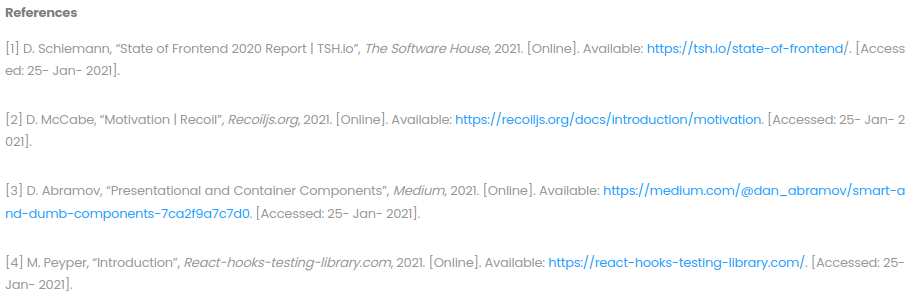

import Authors, { Author } from 'components/authors'

# 디버깅 외

<Authors date="2022년 11월 09일(수)">
  <Author name="김영찬" link="https://twitter.com/shuding_" />
</Authors>

## #디버깅
지금 진행 중인 포폴[(k-theater)](/blog/portfolio1)에서 테스트 코드를 짜며 TDD를 체화 해나가고 있다.  
커버리지 100%를 향해 테스트를 추가 하던 중 React-Redux hooks인 `useSelector()`에서 문제가 생겼다.  
분명 이전처럼 `mockImplementation()`로 잘 작성했는데 에러를 뿜었다.

당황 않고 에러를 잘 읽어서 구글링 해보았으나 문제 해결법이 제각각 이었다.  
(전부터 느낀건데 유저 풀이 적은 기술스택은 시행착오가 축적되어 있지 않아서 해결법이 중구난방이다.)

아무튼 문제를 해결하려고 하나하나 시도를 해보았는데.  
  
진짜 딱 이 움짤과 같은 상황이 벌어졌다...

그래서 디버깅에 예상 밖으로 많은 시간이 소요되었는데.  
내가 후회되는게 딱 2가지가 있었다.
1. 평정심을 찾을걸..
2. 내 코드를 **차근차근 읽어볼걸**..  

왜냐면 허무하게도 문제는 내 코드 오타에서 비롯되었기 때문이다ㅜㅜ  
hooks를 호출할 때 argument의 대소문자가 store의 state key 값이랑 달랐었다.  
빨리 해결하고 싶은 급급한 마음 때문에 오타가 안보인 것 같다.

아무튼 교훈을 얻고 앞으로는 《실용주의 프로그래머》에서 본 [러버덕 디버깅](https://ko.wikipedia.org/wiki/%EA%B3%A0%EB%AC%B4_%EC%98%A4%EB%A6%AC_%EB%94%94%EB%B2%84%EA%B9%85)을 실천 해볼 생각이다.  

## #포폴 구상
일단 지금건 틀이 어느정도 되었고 디자인 구상도 얼추 잡혔다.  
좀더 박차를 가해서 완성하기 위해 데드라인을 **11월 15일**로 잡았다.

확실히 느낀게 뭔가를 만들어 보면서 이해도가 느는 것 같다.  
따라서 다음 포폴도 일단 기술 스택을 `Next.js`와 `typescript`를 쓰는 것으로 결정했다.  
메인 주제는 해외에 웰메이드 사이트를 참고하면서 레퍼런스를 찾을 계획이다.

## #대휴식
학습 중 뽀모도로 타이머를 활용하는 것을 습관 들이고 있다.  
1주일 간 기록을 평균을 내보니 12 뽀모 정도 나왔었다.

그럼 10시에 시작하니까 점심시간 포함하면 한 5~6시 까지는 30분 집중-6분 휴식을 지켰다는건데.  
그 시간 이후에는 집중력이 급격히 방전되어서 뽀모도로 없이 코딩 한 것 같다.

이에대한 대책으로 앞으로 중간에 30분 이상 대휴식 시간을 만들 생각이다.  
그렇게 바람을 쐬던해서 리프레시하여 뽀모 기록을 좀 늘려보아야지.

## 이 블로그
그 동안 여러 플랫폼을 전전하면서 블로그를 정착하지 못했었다.  
그러다 내가 정말 필요하다고 느꼈던 요소들인
1. User가 목록을 한 눈에 보고 접근 가능하게(depth를 최소화)
2. 검색 기능
3. Deploy가 간편
4. 오픈소스라 수정이 가능

를 모두 만족하는게 이 블로그라 이제 드디어 정착할 수 있을 것 같다.

아 그리고 자료 조사를 하다 리디의 기술블로그 글을 보게 되었는데.  
글 짜임새도 좋았지만, 맨 하단에 References 부분이 인상이 깊었다.  
찾아보니 `MLA 인용 가이드` 라는 방식인 것 같다.  
  
↑ MLA 인용 가이드 예시  
해당 가이드는 필요 이상으로 길어서 적절히 변형하여 쓰면 좋을 것 같다.
- - -
Reference)  
[1] 김민준(벨로퍼트), "[리덕스 잘 쓰고 계시나요?](https://ridicorp.com/story/how-to-use-redux-in-ridi/)" [RIDI, 2021 Jan.] | Accessed: 2022-11-08  